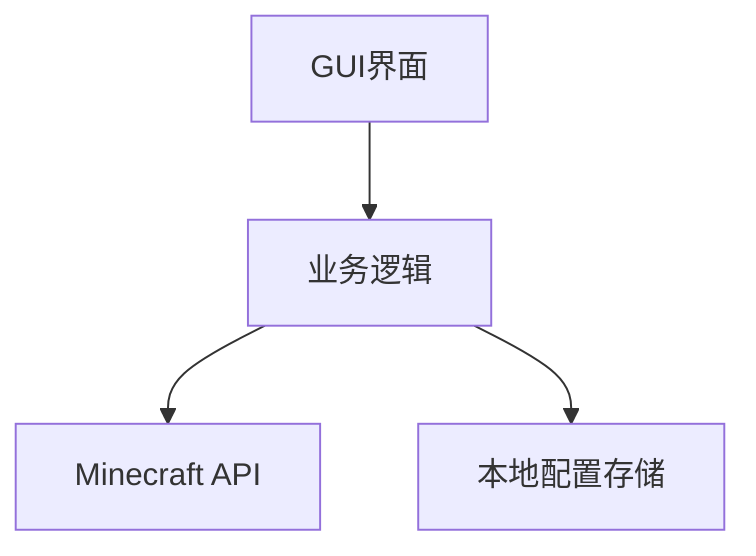
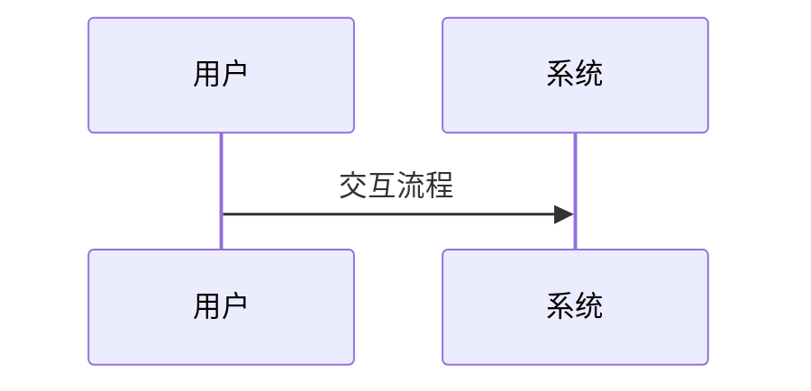

# 项目规划文档

## 1. 业务目标
- 开发一款简洁易用的Minecraft国际版启动器
- 支持多账号管理和游戏版本切换
- 提供基本的启动器设置功能

## 2. 核心功能
- 用户账号管理(登录/切换)
- 游戏版本选择与管理
- 游戏启动功能
- 启动器设置界面

## 3. 整体架构

- GUI层：使用PyQt/PySide实现
- 业务逻辑：处理账号、版本管理等核心功能
- Minecraft API：与官方API交互
- 本地存储：使用JSON存储配置

## 4. 数据实体
- 用户账号：{username, password(加密), skin}
- 游戏版本：{version_id, release_date, type}
- 启动器配置：{theme, memory_setting}

## 5. 业务流程

- 待补充：描述关键业务流程

## 6. 技术栈
- Python 3.x
- 待补充其他技术组件

## 7. 项目结构
```
.
├── src/
├── tests/
├── docs/
└── config/
```
